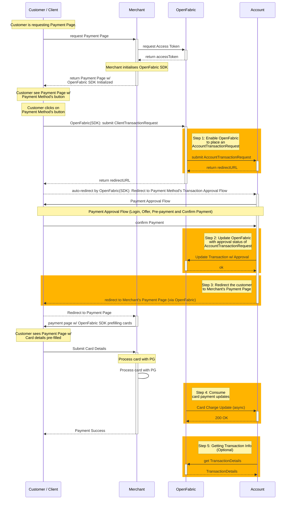

# Account Integration Guide - Orchestrated Model

## 1. Introduction

When an `Account's` Payment Method is integrated into our platform using the `Orchestrated` model, we enable 
* Seamless interaction between the payment method, its customers and its merchants (using our merchant SDK - referred to as ‘OpenFabric SDK’)
* Generate a payment token (unique, one-time use, virtual card created for a specific transaction that is approved) 
* Handover the payment token to the merchant to process it with their existing payment process (or PG) for settlement

This document provides an overview of a customer transaction flow with `Orchestrated` model,  specific interactions an `Account` need to make to enable the experience and integration specific information `Account` will need to be aware of to integrate into our platform.

> Review our [Getting Started](../ZG9jOjQ2Nzk1-getting-started) page to understand the basics of our APIs.   
> [Account Integration](../ZG9jOjIzNjI1Mzcy-account-integration-guide) page to understand the different models available to integrate with OpenFabric.    
> [Merchant Integration](../ZG9jOjIzNjI1Mzcz-merchant-integration-guide) page to understand how merchants integrate with payment methods, challenges they face, how our solution makes it better for them to accept OpenFabric enabled payment methods and integration patterns available for them. 

## 2. Customer Flow and System Interactions

The above interaction flow shows the overall customer journey OpenFabric with a merchant that is integrated with Pre-fill integration pattern. 

To enable the above experience, `Accounts` will need to make the following changes (highlighted in orange).

1. [Enable OpenFabric to place a AccountTransactionRequest](#step-1--enable-openfabric-to-place-a-accounttransactionrequest-openfabric---account) (OpenFabric -> Account)
2. [Update OpenFabric with approval status of AccountTransactionRequest](#step-2-update-openfabric-with-approval-status-of-accounttransactionrequest-account---openfabric) (Account -> OpenFabric)
3. [Redirect the customer to Merchant's Payment Page](#step-3-redirect-the-customer-to-merchants-payment-page)
4. [Consume card payment update](#step-4-consume-merchant-payment-updates-openfabric---account) (OpenFabric -> Account)
5. [Getting Transaction info](#step-5-getting-transaction-info---optional) - optional 

## 3. Integration Steps

### Step 1:  Enable OpenFabric to place a AccountTransactionRequest (OpenFabric -> Account)

When a customer on a merchant's payment page clicks the presented payment button (which is presented on the merchant’s website by OpenFabric's SDK), OpenFabric will place an AccountTransactionRequest to your system.

We will expect a redirect URL to which we will need to send the customer for payment approval.

The AccountTransactionRequest Schema and Expected response schema is available below 

<!--
type: tab
title: AccountTransactionRequest Schema
-->
> [AccountTransactionRequest](../c2NoOjQwMjIxODk5-account-transaction-request) Schema

<!--
type: tab
title: AccountTransactionResponse Schema
-->
>[AccountTransactionResponse](../c2NoOjQwMjIxOTAw-account-transaction-response) Schema

<!-- type: tab-end -->

### Step 2: Update OpenFabric with approval status of AccountTransactionRequest (Account -> OpenFabric)

Once the customer is redirected to the redirect URL from the above step, the customer will go through your payment approval flow.

OpenFabric expects the approval decision for an AccountTransactionRequest to be updated via our UpdateTransaction API.

We will expect one of the below possible results as an update.

Result | Description
-----|-----
**Approved** | Payment is Approved and OpenFabric can now handover a one-time use payment credential to the merchant for this transaction.
**Failed** | Payment is Cancelled/Failed and OpenFabric should not hand over payment credentials to merchant for this transaction.  In the case of a customer cancelling the transaction or if the payment is declined for any other error reasons, update to UpdateTransaction API should include `reason`.

UpdateTransaction API (link below) covers the schema for the API.

<!--
type: tab
title: Update Transaction API and Schema
-->
> [Update Transaction API and Schema](../b3A6MzEwODI0Mjk-update-transaction)
<!-- type: tab-end -->

### Step 3: Redirect the customer to Merchant's Payment Page

Once UpdateTransaction API completed, we expect the customer to be redirected to one of the below OpenFabric Gateway URLs that we provided to you in the AccountTransactionRequest depending on the result of approval for the transaction.

Result | Description
-----|-----
**Approved** | The customer is redirected to `gateway_success_url`.
**Failed** | The customer is redirected to `gateway_fail_url`.

OpenFabric will automatically redirect to the the merchant's payment page depending on the result of the transaction.

### Step 4: Consume merchant payment updates (OpenFabric -> Account)

Post successful approval of an AccountTransactionRequest, OpenFabric will handover a payment token (one-time use virtual credit card) to the merchant. The merchant would process/charge this card using their existing payment processor (usually a payment gateway).

When the payment token(card) is successfully processed by the merchant, OpenFabric will send a real-time update to you about the successful card charge activity. This notification will be sent to the webhook URL (as a POST method). The webhook notification will have the authentication header we would have configured for you (as part of the webhook URL setup).

You are requested to consume these updates and initiate any necessary updates to your workflows (updating status of transactions, etc.) accordingly.

We expect a 200 OK response from your webhook endpoint when you successfully receive the weekhook notification. If we do not receive a 200 OK response, Open Fabric would retry for a specific duration. Refer to [Getting Started](../ZG9jOjQ2Nzk1-getting-started) page to understand more on how we retry. 

The Notifications request schema is available below

<!--
type: tab
title: Card Charge Update Notification Schema
-->
> [Card Charge Update Notification Schema](../c2NoOjQwMjIxOTAy-transaction-charged-notification-request)
<!-- type: tab-end -->

### Step 5: Getting Transaction info - optional

You can also use the Transaction Details API to pull the latest status of a payment transaction. We recommend you to call this API for transactions every 20 mins after approval. 

<!--
type: tab
title: Transaction Details API and Schema
-->
> [Transaction Details API and Schema](../b3A6MjUxNDU2OTg-get-transaction-details)
<!-- type: tab-end -->

## 4. Test the integration
- You will need to be on-boarded onto our platform to test these APIs.
- You will receive the following
 - Access to your servicing portal.
 - clientId and clientSecret for your account(Sandbox and production will have different keys). 
- Use your sandbox keys to run test transactions.

## 5. Go Live
To be Updated.

## 6. References
- [API and Schema Explorer](../YXBpOjIwNDQ3MDY1-accounts)
- [Samples]

